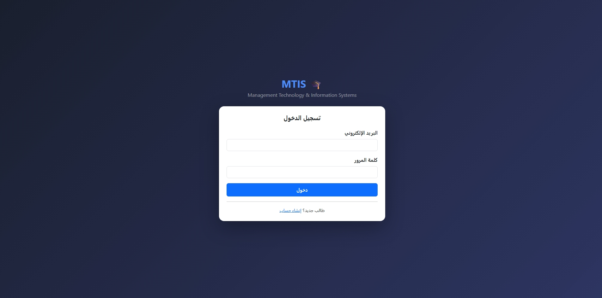
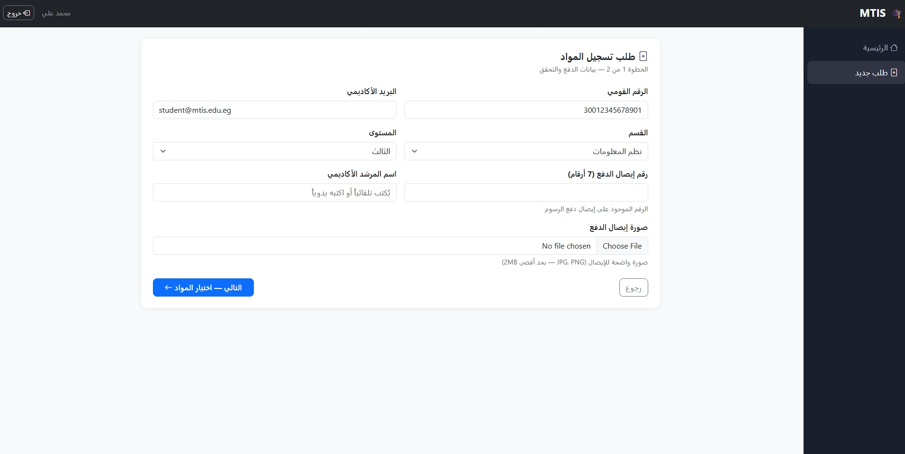
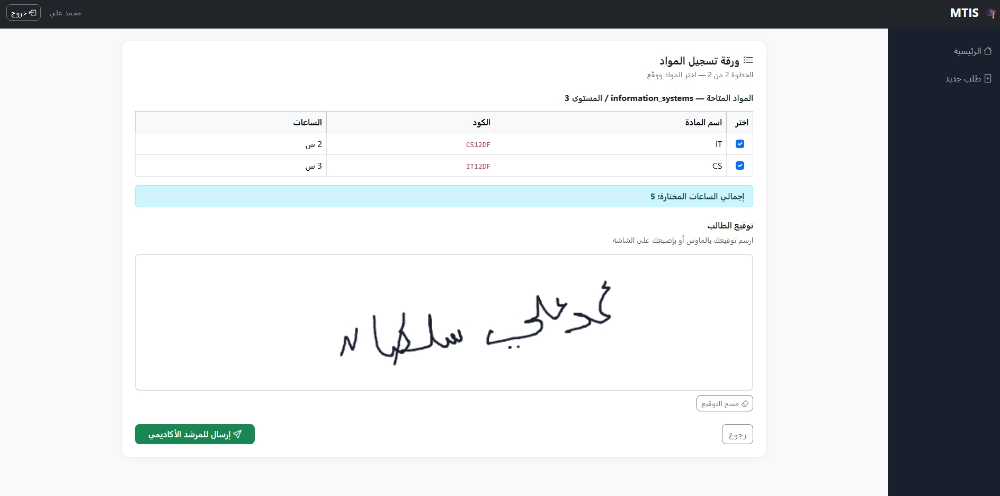
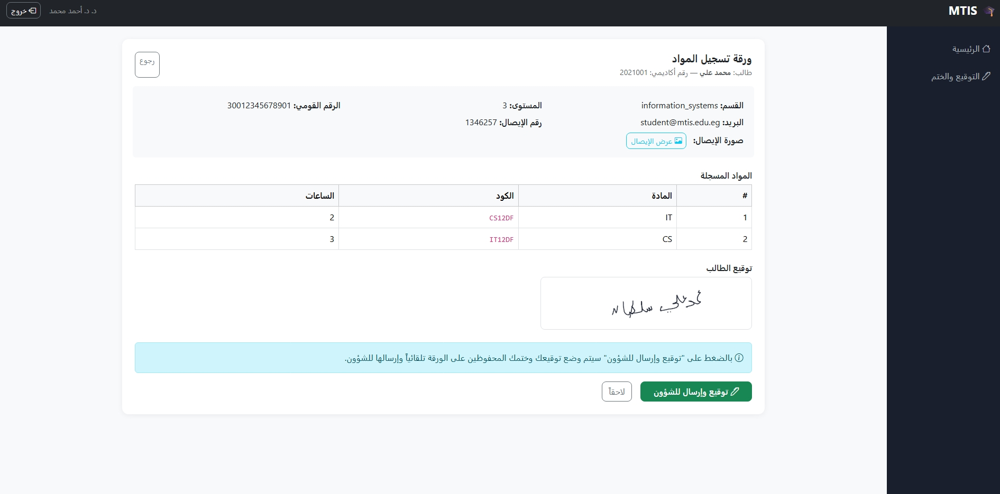
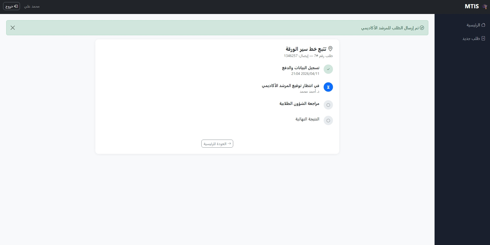
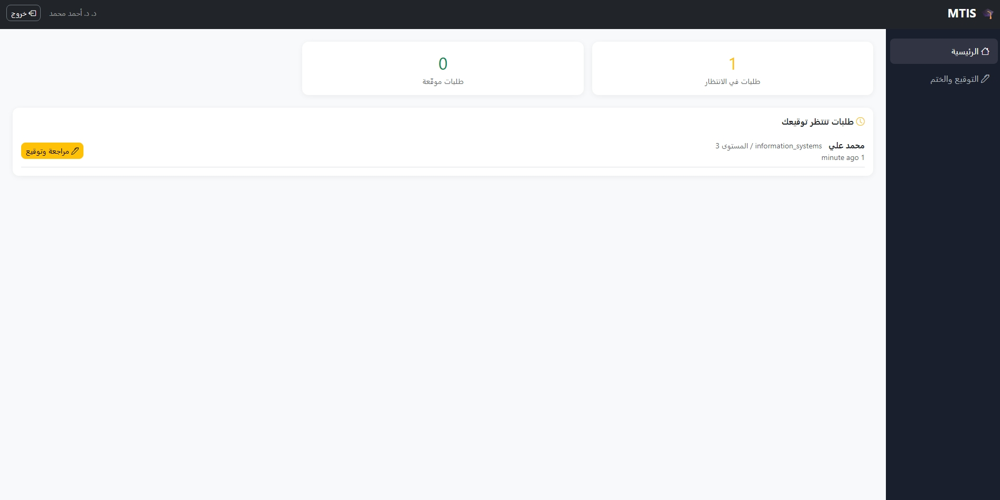
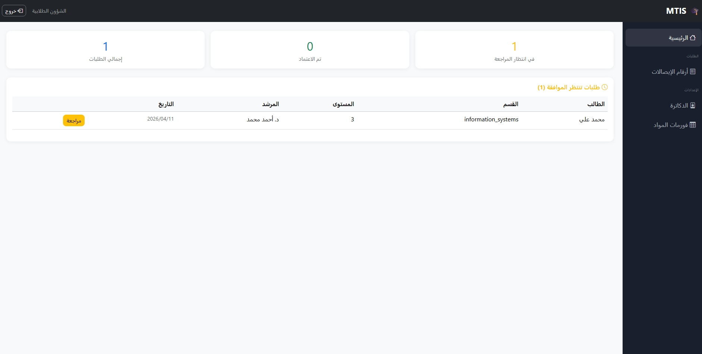
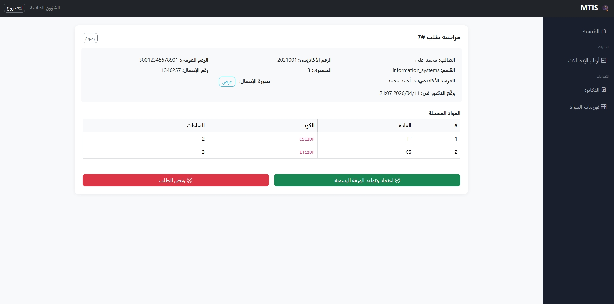
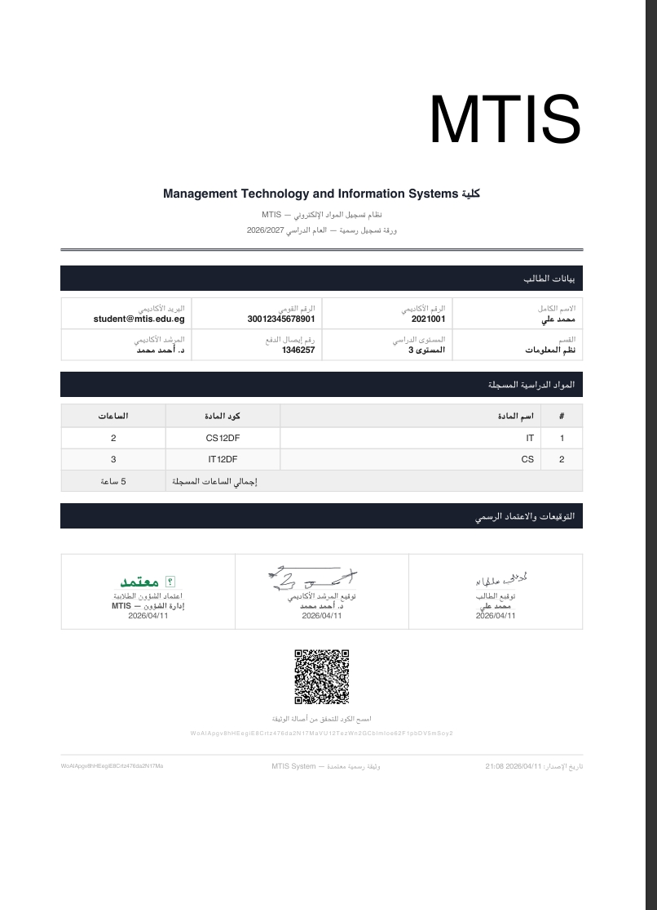
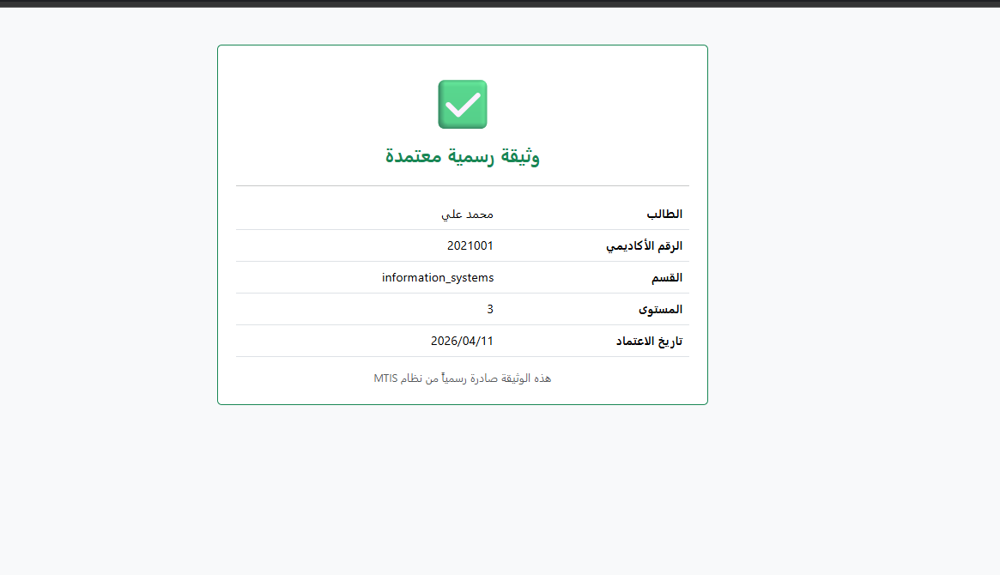

<div align="center">

# 🎓 MTIS
### Management Technology and Information Systems
**نظام تسجيل المواد الإلكتروني**
## 📸 System Screenshots

<div align="center">

### 🔐 Login Page


---

### 💳 Payment Data Entry


---

### 📚 Course Registration


---

### ✍️ Student Signature & Doctor Approval


---

### 🔄 Tracking System


---

### 👨‍🏫 Academic Advisor Dashboard


---

### 🏢 Student Affairs Dashboard


---

### 📋 Review Request (Student Affairs)


---

### 📄 Final Approved Document (PDF)


---

### 📱 QR Code Verification System


</div>
---

*نظام إلكتروني متكامل يُحوّل عملية تسجيل المواد الدراسية من ورق إلى رقمي — بتوقيعات مشفرة وQR Code وPDF رسمي*

</div>

---

## 📋 فهرس المحتويات

- [لقطات من النظام](#-لقطات-من-النظام)
- [المميزات](#-المميزات)
- [المتطلبات](#-المتطلبات)
- [التثبيت السريع](#-التثبيت-السريع)
- [هيكل المشروع](#-هيكل-المشروع)
- [الأدوار والصلاحيات](#-الأدوار-والصلاحيات)
- [كيفية الاستخدام](#-كيفية-الاستخدام)
- [التقنيات المستخدمة](#-التقنيات-المستخدمة)
- [قاعدة البيانات](#-قاعدة-البيانات)
- [الأمان](#-الأمان)
- [المساهمة](#-المساهمة)

---

## ✨ المميزات

| الميزة | التفاصيل |
|--------|----------|
| 🔐 **3 أدوار مختلفة** | طالب — مرشد أكاديمي — شؤون طلابية |
| ✍️ **توقيع إلكتروني** | Canvas تفاعلي بالماوس أو اللمس |
| 🔒 **تشفير كامل** | التوقيعات مشفرة AES-256 لا يراها أحد |
| 📄 **PDF رسمي** | يُولَّد تلقائياً بكل التوقيعات والختم |
| 📱 **QR Verification** | تحقق فوري من أي ورقة بكاميرا الموبايل |
| 🔍 **تتبع لحظي** | الطالب يرى خط سير ورقته في الوقت الفعلي |
| ⚡ **Auto-fill** | اسم المرشد يُكتب تلقائياً من البريد الإلكتروني |
| 🧾 **التحقق من الإيصال** | رقم الإيصال يُستخدم مرة واحدة فقط |
| 📋 **فورمات مرنة** | الشؤون تتحكم في قائمة المواد لكل قسم ومستوى |

---

## 💻 المتطلبات

قبل التثبيت تأكد من وجود:

- **PHP** >= 8.2 مع Extensions: `gd`, `mbstring`, `openssl`, `pdo_mysql`, `fileinfo`
- **Composer** >= 2.x
- **MySQL** >= 8.x أو MariaDB >= 10.x
- **Node.js** >= 18.x و npm
- **XAMPP** (لبيئة Windows) أو أي LAMP/LEMP server

---

## 🚀 التثبيت السريع

### الخطوة 1 — استنساخ المشروع
```bash
cd C:\xampp\htdocs
git clone https://github.com/YOUR_USERNAME/MTIS.git
cd MTIS
```

### الخطوة 2 — تثبيت الـ Dependencies
```bash
composer install
npm install
```

### الخطوة 3 — إعداد ملف البيئة
```bash
copy .env.example .env
php artisan key:generate
```

ثم افتح `.env` وعدّل:
```env
APP_NAME=MTIS
APP_URL=http://localhost/MTIS/public

DB_CONNECTION=mysql
DB_HOST=127.0.0.1
DB_PORT=3306
DB_DATABASE=mtis_db
DB_USERNAME=root
DB_PASSWORD=
```

### الخطوة 4 — إنشاء قاعدة البيانات
افتح `http://localhost/phpmyadmin` وأنشئ قاعدة بيانات اسمها `mtis_db` بـ collation: `utf8mb4_unicode_ci`

### الخطوة 5 — تشغيل الـ Migrations
```bash
php artisan migrate
php artisan db:seed --class=AdminSeeder
php artisan storage:link
```

### الخطوة 6 — تشغيل المشروع
```bash
php artisan serve
```

افتح المتصفح على: `http://127.0.0.1:8000`

---

## 🔑 حسابات الدخول التجريبية

| الدور | البريد | كلمة المرور |
|-------|--------|-------------|
| 🏢 الشؤون | `shuoun@mtis.edu.eg` | `Shuoun@2024` |
| 👨‍🏫 الدكتور | `ahmed@mtis.edu.eg` | `Doctor@2024` |
| 🎓 الطالب | `student@mtis.edu.eg` | `Student@2024` |


---

## 📁 هيكل المشروع

```
MTIS/
├── app/
│   ├── Http/
│   │   ├── Controllers/
│   │   │   ├── AuthController.php        # تسجيل الدخول والخروج
│   │   │   ├── StudentController.php     # كل عمليات الطالب
│   │   │   ├── DoctorController.php      # لوحة الدكتور والتوقيع
│   │   │   └── ShuounController.php      # إدارة الشؤون الكاملة
│   │   └── Middleware/
│   │       └── RoleMiddleware.php        # التحقق من الصلاحيات
│   ├── Models/
│   │   ├── User.php                      # المستخدمون (3 أدوار)
│   │   ├── RegistrationForm.php          # طلبات التسجيل
│   │   ├── FormTemplate.php              # قوالب المواد
│   │   ├── ReceiptNumber.php             # أرقام الإيصالات
│   │   └── AdvisorAssignment.php         # إسناد الطلاب للدكاترة
│   └── Providers/
│       └── AppServiceProvider.php        # Blade Directives
├── database/
│   ├── migrations/                        # 5 migration files
│   └── seeders/
│       └── AdminSeeder.php               # بيانات تجريبية
├── resources/
│   └── views/
│       ├── layouts/
│       │   └── app.blade.php             # القالب الرئيسي
│       ├── auth/
│       │   ├── login.blade.php
│       │   └── register.blade.php
│       ├── student/
│       │   ├── dashboard.blade.php
│       │   ├── register-form.blade.php
│       │   ├── subject-form.blade.php
│       │   └── track.blade.php
│       ├── doctor/
│       │   ├── dashboard.blade.php
│       │   ├── setup.blade.php
│       │   └── form.blade.php
│       ├── shuoun/
│       │   ├── dashboard.blade.php
│       │   ├── form.blade.php
│       │   ├── templates.blade.php
│       │   ├── template-form.blade.php
│       │   ├── receipts.blade.php
│       │   ├── doctors.blade.php
│       │   ├── doctor-form.blade.php
│       │   └── assignments.blade.php
│       ├── pdf/
│       │   └── registration.blade.php    # قالب الورقة الرسمية
│       └── verify.blade.php              # صفحة QR Verification
└── routes/
    └── web.php                           # كل الـ Routes
```

---

## 👥 الأدوار والصلاحيات

```
┌─────────────────────────────────────────────────────┐
│                     MTIS System                     │
├───────────────┬──────────────────┬──────────────────┤
│    طالب       │  مرشد أكاديمي   │      شؤون        │
├───────────────┼──────────────────┼──────────────────┤
│ تسجيل حساب   │ إعداد التوقيع   │ إضافة دكاترة    │
│ تقديم طلب    │ مراجعة الطلبات  │ إسناد الطلاب    │
│ اختيار مواد  │ التوقيع الرقمي  │ أرقام الإيصالات │
│ التوقيع      │ إرسال للشؤون    │ فورمات المواد   │
│ تتبع الورقة  │                  │ الاعتماد/الرفض  │
│ تحميل PDF    │                  │ توليد PDF+QR    │
└───────────────┴──────────────────┴──────────────────┘
```

---

## 🔄 خط سير العملية

```
الطالب يدفع الرسوم
        ↓
يسجل على الموقع ويرفع صورة الإيصال
        ↓
يختار المواد ويوقع إلكترونياً
        ↓
الورقة تذهب تلقائياً → المرشد الأكاديمي
        ↓
الدكتور يوقع بالتوقيع والختم المحفوظ
        ↓
الورقة تذهب تلقائياً → الشؤون
        ↓
الشؤون تعتمد ← النظام يولد PDF + QR
        ↓
الطالب يحمّل الورقة الرسمية ✅
```

---

## 🛠 التقنيات المستخدمة

### Backend
| التقنية | الإصدار | الاستخدام |
|---------|---------|-----------|
| PHP | 8.2+ | لغة البرمجة الأساسية |
| Laravel | 12.x | إطار العمل |
| mPDF | Latest | توليد PDF بدعم عربي كامل |
| endroid/qr-code | Latest | توليد QR Code PNG |

### Frontend
| التقنية | الإصدار | الاستخدام |
|---------|---------|-----------|
| Blade Templates | - | محرك القوالب |
| Bootstrap RTL | 5.3.2 | تنسيق الواجهة |
| Bootstrap Icons | 1.11.0 | الأيقونات |
| Canvas API | Native | رسم التوقيع الإلكتروني |
| Fetch API | Native | Auto-fill للمرشد الأكاديمي |

### Database
| التقنية | الاستخدام |
|---------|-----------|
| MySQL 8.x | قاعدة البيانات الرئيسية |
| Laravel Eloquent ORM | التعامل مع قاعدة البيانات |
| Laravel Migrations | إدارة هيكل الجداول |

---

## 🗄 قاعدة البيانات

```
users                    registration_forms
─────────────────        ──────────────────────────
id (PK)                  id (PK)
name                     student_id (FK→users)
email (unique)           national_id
password (bcrypt)        academic_email
role (enum)              department
academic_id              level
national_id              receipt_number (unique)
department               receipt_image_path
level                    academic_advisor_name
signature_data (enc)     subjects (JSON)
stamp_path               student_signature (enc)
                         status (enum)
                         doctor_signature (enc)
form_templates           doctor_stamp_path
──────────────────       doctor_signed_at
id (PK)                  approved_by (FK→users)
department               approved_at
level                    rejection_reason
academic_year            unique_hash
subjects (JSON)          qr_code_path
is_active                pdf_path
created_by (FK)
                         advisor_assignments
receipt_numbers          ───────────────────
────────────────         id (PK)
id (PK)                  doctor_id (FK→users)
receipt_number (7)       student_email (unique)
is_used
used_by (FK→users)
```

---

## 🔒 الأمان

- **كلمات المرور**: مشفرة بـ `bcrypt` — غير قابلة للقراءة حتى من قاعدة البيانات
- **التوقيعات**: مشفرة بـ `AES-256` عبر `encrypt()/decrypt()` — لا تظهر لأحد
- **الختم**: محفوظ في `storage/app/local` — غير متاح من URL مباشر
- **الصلاحيات**: `RoleMiddleware` يحمي كل Route
- **الإيصالات**: منع الاستخدام المكرر عبر `unique constraint + is_used flag`
- **QR Hash**: عشوائي 64 حرف يستحيل تخمينه (`Str::random(64)`)
- **CSRF**: كل Form محمي تلقائياً بـ Laravel

---

## 🤝 المساهمة

1. Fork المشروع
2. أنشئ Branch جديد: `git checkout -b feature/اسم-الميزة`
3. Commit التغييرات: `git commit -m 'إضافة ميزة كذا'`
4. Push: `git push origin feature/اسم-الميزة`
5. افتح Pull Request

---

## 📝 الترخيص

هذا المشروع مفتوح المصدر للأغراض التعليمية.

---


# university-course-registration-system


